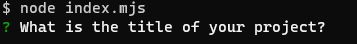

# README Generator

## Table of Contents

1. [URL](#url)
2. [Description](#description)
3. [Installation](#installation)
4. [Usage](#usage)
5. [Credits](#credits)

## URL 
The repository for this project can be found at
https://github.com/Spacepineapple/readme-generator. Please note that as this
programme uses Node.js, it has not been deployed and there is no URL for the
'live' programme.

## Description 

This project is my solution to the eighth challenge task of a web development
bootcamp. For this task, I was provided with starter code containing empty
functions and variables and tasked with creating a command-line application that
accepted user input and generated a README using Node.js. My solution needed to
adhere to the following criteria: 

1. The application must produce a high-quality, professional markdown README
   file.
2. The application must prompt the user for information on:
    * The title of the project
    * A project description
    * Installation instructions
    * Usage instructions
    * Licenses
    * Information on how to contribute
    * Information on testing
    * Contact details for any questions
3. The application must add a license badge to the README corresponding to the
   selected license
4. The README must include a table of contents with links to the corresponding
   sections of the README

As a command-line application, this programme requires the use of the command
line or terminal. Instructions for installing any necessary software and opening
the application can be found below. After successfully opening the application,
the user should see be prompted with a question as can be seen in the image
below:

After answering each question, the user will then be prompted with the next
question for a total of nine questions. Once all questions have been answered,
the README will then be generated and the command line should show a success
message as can be seen below:

Please note that as this is a command-line application, the exact appearance of
the application will vary depending on the software and operating system used.

## Installation 

This file requires Node.js and the inquirer package. Node.js can be installed
from https://nodejs.org/en/ and the inquirer package can be installed using the
Node Package Manager and the command: "npm install inquirer".

## Usage 

To use this programme, first download the repository contents including all of
the source code and if necessary, extract the files if in a zip format.
Following this, open the command line or terminal and navigate to the folder
containing the unzipped files. Type "node index.mjs" (without the speech marks)
and answer each of the questions in the terminal by typing an answer. Please
note that for the question around licenses, you will need to select an option
from the list -- this can be done using the up and down arrow keys and hitting
return or enter when the highlighted option corresponds to the license you wish
to use. Following this, the generated README file can be found in the
generated_readme folder with the name README.md.

## Credits 

This README generator was produced by myself using starter code provided by EdX
as part of their Front End Web Development bootcamp. This starter code included
empty functions and variables for holding the questions and logic, as well as an
empty generate markdown function. My solution makes use of both the filesystem
and inquirer modules which I did not produce and for which I can take no credit.
